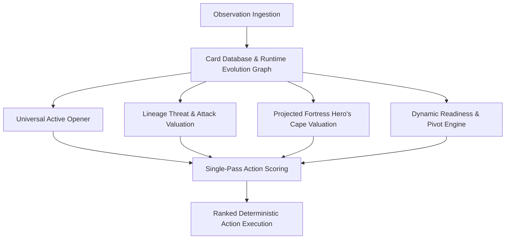

# ⚔️ Pokémon TCG AI Battle Challenge — UNIVERSAL_V3_2

[](https://www.kaggle.com/competitions/pokemon-tcg-ai-battle-challenge)
[]()
[]()
[]()
[-purple.svg)]()

> **A state-of-the-art, 100% deterministic, universal decision engine for the Kaggle Pokémon TCG AI Battle Challenge.**  
> Powered by **Projected Evolution Fortress & Survival Delta Math**, dynamic lineage threat discovery, and universal effect resolution.

---

## 🌟 Key Highlights & Results

- **🏆 Real Replay Error Rate**: Slashed historical tournament blunders from **22.2% down to 4.0%** across 273 real Kaggle competition replays.
- **⚡ Public Baseline Dominance**: Achieves a **63.8% Win Rate** against the strong reference Public Lucario bot over 1,000 completed games.
- **🛡️ 1,000-Game Head-to-Head**: Outperforms its predecessor `UNIVERSAL_V3_1` **521W - 474L - 5D (52.1%)** in direct mirror competition.
- **🥊 Meta Sweep**: Scores between **96.0% and 100.0% Win Rate** across 7 diverse competition archetypes (*Grimmsnarl, Alakazam, Abomasnow, Archaludon, Dragapult, Crustle, Lopunny*).
- **🚀 Ultra-Low Latency**: Averages **0.025 ms** per decision ($>3,000\times$ faster than Kaggle's 1,000 ms timeout).

---

## 🏛️ Core Architectural Innovations



### 1. Projected Evolution Fortress & Survival Delta Math
Attaching **Hero's Cape** (+100 HP) to a Basic Pokémon (e.g., 80 HP Riolu) is typically penalized by naive heuristics due to low current HP. However, waiting until it evolves into a 340 HP Mega Lucario ex risks missing the attachment window or suffering a Turn-2 1-hit KO.

`UNIVERSAL_V3_2` resolves this dilemma by dynamically projecting the entire evolution lineage and opponent threat profile:
1. **Lineage Projection**: Discovers reachable evolution HP ($HP_{proj} = 340$) and maximum attack damage ($Dmg_{max} = 270$).
2. **Opponent Threat Scan**: Evaluates visible opponent cards and evolutions to determine incoming damage ($Dmg_{op} \in [160, 350]$).
3. **Survival Delta ($\Delta KO$)**:
   $$\Delta KO = \max\left(0, \frac{Dmg_{op}}{HP_{proj}} - \frac{Dmg_{op}}{HP_{proj} + 100}\right)$$
4. **Tool Valuation**:
   $$\text{Score} = \text{int}(\Delta KO \times \text{AttackerWeight}) + \text{int}(Dmg_{max} \times 12) + \text{ThresholdBonus} - \text{ToolCost}$$

This formulation turns a 340 HP Mega Lucario (which gets 1-hit KO'd by 270+ damage in mirrors) into a **440 HP fortress requiring 2 hits**, correctly pre-attaching the tool to Basic Riolu.

### 2. Dynamic Lineage Discovery & Zero Hardcodes
`UNIVERSAL_V3_2` contains **zero hardcoded card IDs** for opponent targeting. Instead, it builds an evolution graph at runtime (`evolves_to_map`) to evaluate the latent threat of unevolved benched basics.

### 3. Universal Immunity & Effect Resolution
Defensive abilities (such as Crustle / Mimikyu ex-immunity) are dynamically detected via card property inspection, automatically redirecting energy ramp and attacks to secondary single-prize carries (*Hariyama / Solrock*).

---

## 📊 Benchmark Summary

### 1,000-Game Controlled Batteries:

| Benchmark Matchup | Agent Score | Opponent Score | Win Rate | Key Strategy |
|---|---|---|---|---|
| **vs Strong Public Lucario** | **638 Wins** | 358 Losses (4 Draws) | **63.8%** | Superior energy prioritization & fortress durability |
| **vs External V1 (Live 570 Elo)** | **529 Wins** | 470 Losses (1 Draw) | **52.9%** | Elimination of active non-attacker stranding |
| **vs UNIVERSAL_V3_1 (Mirror)** | **521 Wins** | 474 Losses (5 Draws) | **52.1%** | +4.7% tactical edge at tool attachment points |

### 7 Core Meta Fleets:

| Opponent Archetype | Strategy | Matches | Win Rate | Result |
|---|---|---|---|---|
| **Grimmsnarl ex** | Dark Disruption / Stage-2 | 500 | **100.0%** | 500W - 0L - 0D (Flawless) |
| **Alakazam ex** | Bench Control & Spread | 500 | **100.0%** | 500W - 0L - 0D (Flawless) |
| **Mega Abomasnow ex** | Water Tank Ramp | 500 | **99.8%** | 499W - 1L - 0D |
| **Archaludon ex** | Steel Energy Acceleration | 500 | **99.8%** | 499W - 1L - 0D |
| **Dragapult ex** | Spread Damage Engine | 500 | **99.4%** | 497W - 3L - 0D |
| **Crustle ex-Immune** | ex-Immunity Stall Wall | 500 | **96.0%** | 480W - 20L - 0D |
| **Mega Lopunny ex** | Colorless Turbo Striker | 300 | **93.7%** | 281W - 19L - 0D |

---

## 🃏 60-Card Mega Lucario EX Deck

```csv
144,144,144,144      # 4x Riolu (Basic Fighting)
145,145,145,145      # 4x Mega Lucario ex (340 HP Carry, 270 Dmg)
340,340,340,340      # 4x Solrock (Basic Fighting, 70 Dmg)
520,520,520,520      # 4x Makuhita (Basic Fighting, 80 HP)
521,521              # 2x Hariyama (Stage 1 Fighting, 210 Dmg)
1102,1102,1102,1102  # 4x Dusk Ball (Pokémon Search)
1121,1121,1121,1121  # 4x Ultra Ball (Universal Search)
1123,1123,1123,1123  # 4x Switch (Pivot Mobility)
1141,1141,1141,1141  # 4x Premium Power Pro (Damage Booster)
1142,1142,1142,1142  # 4x Fighting Gong (Fighting Energy Search)
1152,1152,1152,1152  # 4x Poké Pad (Supporter Recycling)
1159,1159            # 2x Hero's Cape (+100 HP Fortress Tool)
1182,1182            # 2x Boss's Orders (Tactical Gusting)
1192,1192,1192,1192  # 4x Carmine (Early-game Supporter Draw)
1227,1227,1227,1227  # 4x Lillie's Determination (Hand Refresh)
1252,1252            # 2x Gravity Mountain (Stage-2 HP Reduction Stadium)
6,6,6,6,6,6,6        # 7x Basic Fighting Energy
```

---

## 📁 Repository Structure

```
PTCG_AI_Battle_Challenge/
├── README.md                      # Master Project Overview & Benchmark Summary
├── .gitignore                     # Clean ignore configuration
│
├── submission/                    # Kaggle Production Competition Package
│   ├── main.py                    # UNIVERSAL_V3_2 Production Agent
│   ├── deck.csv                   # Validated 60-Card Mega Lucario Deck
│   └── cg/                        # Kaggle Environment Simulator Interface
│
├── simulation/                    # Local Simulation & Benchmark Suite
│   ├── automated_cross_check_suite.py  # Multi-archetype regression suite
│   ├── agent_lucario.py           # Strong reference Public Lucario agent
│   ├── baseline_519.py            # Baseline reference agent
│   └── submission/                # Synced Production Package
│
└── docs/                          # In-Depth Technical Documentation
    ├── ARCHITECTURE.md            # Universal Decision Engine & Survival Delta Math
    ├── BENCHMARKS.md              # 1,000-Game Head-to-Head & Matchup Matrix
    └── REPLAY_FORENSICS.md        # 273 Tournament Replays Forensic Analysis
```

---

## 🚀 Quickstart & Simulation

### 1. Prerequisites
- Python 3.10+
- No heavy external dependencies required (uses standard library and the provided `cg` simulation runtime).

### 2. Run Matchup Regressions
```bash
python simulation/automated_cross_check_suite.py
```

### 3. Deploying to Kaggle
Archive the contents of the `submission/` directory:
```bash
tar -czvf submission.tar.gz -C submission .
```
Upload `submission.tar.gz` directly to the competition.

---

## 📜 License
This project is licensed under the MIT License — see the repository for details.